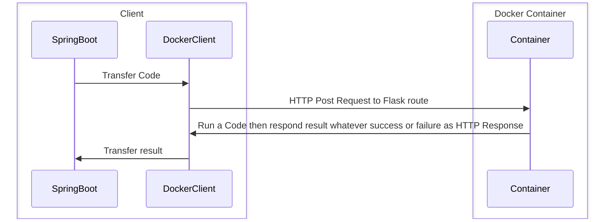
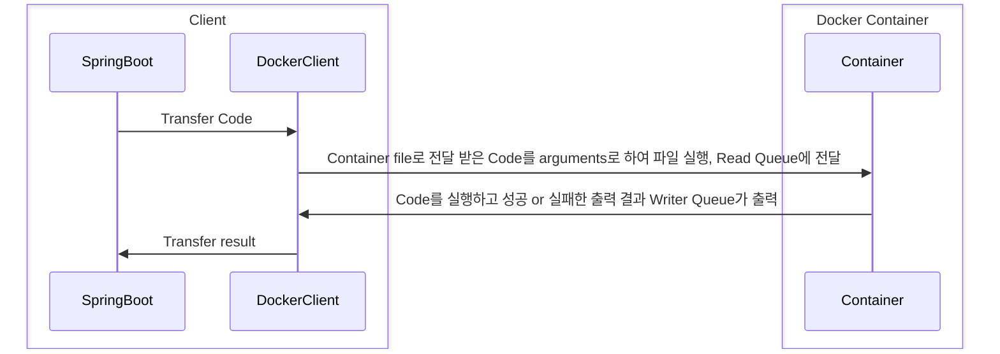
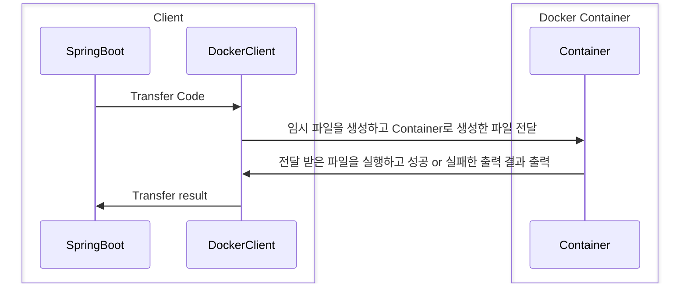
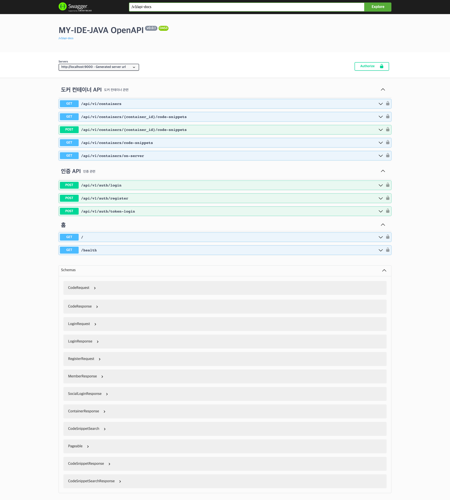
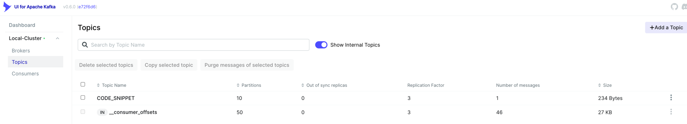
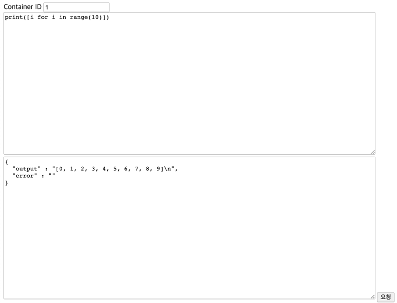
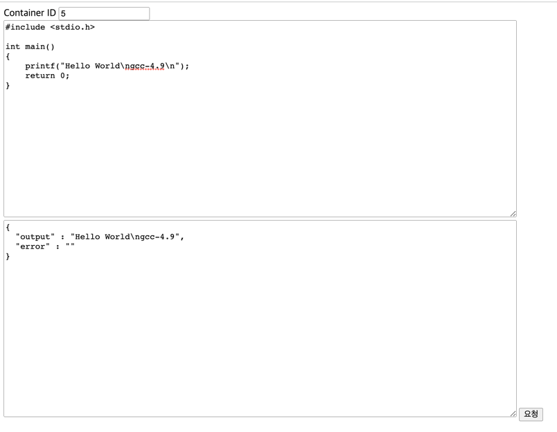

# MY IDE (version. JAVA)

[](https://github.com/sanggi-wjg/my-ide-java/actions/workflows/build-test-main.yml)
[](https://www.codefactor.io/repository/github/sanggi-wjg/my-ide-java)
[](https://codecov.io/gh/sanggi-wjg/my-ide-java)

### Codecov coverage


## Development Environment


```shell
Java 17 (corretto)
Spring boot 3.0.2
JPA Hibernate 6.1.6
```


## TODO
* [ ] Kafka 연동 추가 작업 및 리팩토링
* [ ] Redis는 할까? 말까? 할까? 말까?
* [ ] Gradle 멀티 모듈 변경


## Install & Start
* To begin, Install Docker and Docker Compose on your server or local machine.
* Once installed successfully, run the below docker-compose command.
```shell
docker-compose --env-file .env.docker up -d
```
* After Gradle build, execute MainApplication(MyIdeJavaApplication) with the `local` profile as Spring Boot active profiles.


## Concept Description 
I wanted to explore different ways of executing actual code in Docker containers.  
So I proceeded with three ways.


### Python 3.8
Implement using an HTTP request with container.




### Python 2.7
Run a file, that is already implemented with a queue, on container.




### PHP 8.2, PHP 7.4, GCC 4.9
After create temp file, transfer the file to container.  
Then, run a file on container.




## Usage
### Swagger
* http://localhost:9000/swagger-ui/index.html




### Kafka UI
* http://localhost:8081/





### Jacoco
* gradle > Tasks > verification > test `(For Result of Test)`
  * build > reports > tests > index.html
* gradle > Tasks > verification > jacocoTestReport `(For Coverage)`
  * build > jacoco > test > html  > index.html

### Codecov
* https://app.codecov.io/gh/sanggi-wjg/my-ide-java
  * ref
    * https://about.codecov.io/blog/setting-up-codecov-with-java-and-gradle/
    * https://jane514.tistory.com/12


### Local Test view
* Test viewfile for API Test on local
  * test/resources/test_view.html





### GitHub action script test using act
* https://github.com/nektos/act
```shell
act -l
act --container-architecture linux/amd64
```


### Ref
* JWT 구현 참조
  * https://medium.com/geekculture/implementing-json-web-token-jwt-authentication-using-spring-security-detailed-walkthrough-1ac480a8d970
